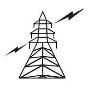

# LoadForecasting
<!--
*** Thanks for checking out this README Template. If you have a suggestion that would
*** make this better please fork the repo and create a pull request or simple open
*** an issue with the tag "enhancement".
*** Thanks again! Now go create something AMAZING! :D
-->


<!-- PROJECT SHIELDS -->
<!--
*** I'm using markdown "reference style" links for readability.
*** Reference links are enclosed in brackets [ ] instead of parentheses ( ).
*** See the bottom of this document for the declaration of the reference variables
*** for build-url, contributors-url, etc. This is an optional, concise syntax you may use.
*** https://www.markdownguide.org/basic-syntax/#reference-style-links
-->
[![Build Status][build-shield]][build-url]
[![Contributors][contributors-shield]][contributors-url]
[![LinkedIn][linkedin-shield]][linkedin-url]


<!-- PROJECT LOGO -->
<br />
<p align="center">
  <a href="https://github.com/JoyMichael7842/LoadForecasting">
    
  </a>

  <h3 align="center">Load Forecasting</h3>

  <p align="center">
    Using LSTMS and Flask!
    <br />
    <a href="https://github.com/othneildrew/Best-README-Template"><strong>Explore the docs »</strong></a>
    <br />
    <br />
    <a href="https://github.com/JoyMichael7842/LoadForecasting">View Demo</a>
    ·
    <a href=""https://github.com/JoyMichael7842/LoadForecasting"/issues">Request Feature</a>
  </p>
</p>


<!-- TABLE OF CONTENTS -->
## Table of Contents

* [About the Project](#about-the-project)
  * [Built With](#built-with)
* [Roadmap](#roadmap)
* [Contributing](#contributing)
* [Contact](#contact)


<!-- ABOUT THE PROJECT -->
## About The Project

Load forecasting is really required for an electrical organization or a government body so they can buy the necessary shares in case of a heavy demand of power.  
Here's why:
* Basically saves a lot of time  
* Can know beforehand if there will be a power shortage 

Of course, even this is not 100% accurate.I tried to reduce the loss to a max of 5%


### Built With
This section should list any major frameworks that you built your project using. Leave any add-ons/plugins for the acknowledgements section. Here are a few examples.
* [Python3](https://www.python.org)
* [Dash](https://plot.ly/dash)
* [tensorflow](https://www.tensorflow.org)


### Installation

2. Clone the repo
```sh
git clone https://github.com/JoyMichael7842/LoadForecasting.git
```


<!-- ROADMAP -->
## Roadmap

See the [open issues](https://github.com/JoyMichael7842/LoadForecasting/issues) for a list of proposed features (and known issues).


<!-- CONTRIBUTING -->
## Contributing

Contributions are what make the open source community such an amazing place to be learn, inspire, and create. Any contributions you make are **greatly appreciated**.

1. Fork the Project
2. Create your Feature Branch (`git checkout -b feature/AmazingFeature`)
3. Commit your Changes (`git commit -m 'Add some AmazingFeature'`)
4. Push to the Branch (`git push origin feature/AmazingFeature`)
5. Open a Pull Request


<!-- CONTACT -->
## Contact

Your Name - [Joy Michael] - joynalanda@gmail.com

Project Link: [https://github.com/JoyMichael7842/LoadForecasting](https://github.com/your_username/repo_name)

<!-- MARKDOWN LINKS & IMAGES -->
<!-- https://www.markdownguide.org/basic-syntax/#reference-style-links -->
[build-shield]: https://img.shields.io/badge/build-passing-brightgreen.svg?style=flat-square
 
 
Leave a comment

Attach files by dragging & dropping, selecting or pasting them.
[build-url]: #
[contributors-url]: https://github.com/JoyMichael7842/LoadForecasting
[linkedin-shield]: https://img.shields.io/badge/-LinkedIn-black.svg?style=flat-square&logo=linkedin&colorB=555
[linkedin-url]: https://www.linkedin.com/in/joy-michael/
[product-screenshot]: https://raw.githubusercontent.com/othneildrew/Best-README-Template/master/screenshot.png

